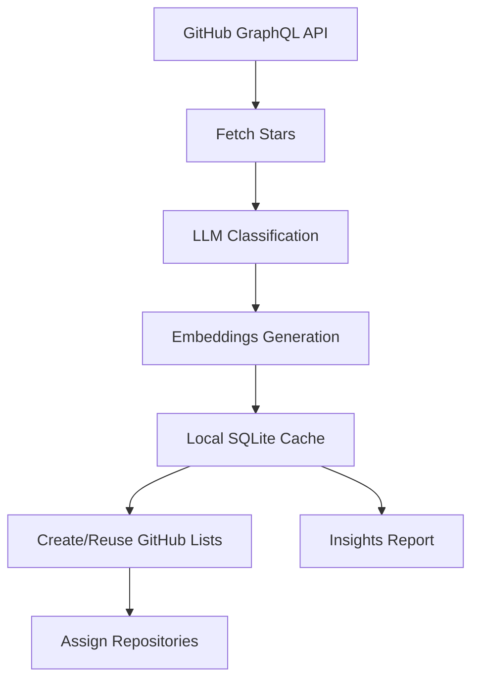

# gh-stars-organizer

`gh-stars-organizer` helps you turn a chaotic GitHub stars list into a searchable, structured knowledge base.

It fetches your starred repositories, classifies them with an LLM, builds embedding-based similarity search, and organizes results into GitHub Lists (with a local fallback when list APIs or scopes are unavailable).

Project site: `https://vins13pattar.github.io/gh-stars-organizer/`

## Why this exists

Developers star hundreds of repositories and later struggle to find what matters.  
This tool makes starred repos discoverable again.

## Key capabilities

- Fetch all stars (with pagination for large accounts)
- LLM-based repository classification into practical engineering categories
- Embedding-based semantic search and similarity grouping
- Automatic organization into GitHub User Lists
- Local cache (SQLite + FAISS) to avoid repeated expensive work
- Insights report (`stars-insights.md`) with trends and cleanup recommendations
- Interactive terminal UI (`tui`) for one-click workflows

## Architecture



## Installation

### Requirements

- Python 3.11+
- [GitHub CLI](https://cli.github.com/) authenticated
- OpenAI-compatible API key (`OPENAI_API_KEY`) for remote classification/embeddings (optional; local fallbacks exist)

### Install from source

```bash
git clone https://github.com/vins13pattar/gh-stars-organizer.git
cd gh-stars-organizer
python -m venv .venv
source .venv/bin/activate
pip install -e ".[dev]"
```

## Quickstart

```bash
gh-stars-organizer config --init
gh-stars-organizer sync
gh-stars-organizer preview
gh-stars-organizer organize
gh-stars-organizer insights
```

## Commands

- `gh-stars-organizer sync` — fetch and cache stars
- `gh-stars-organizer preview` — show predicted category per repo
- `gh-stars-organizer organize` — assign repositories into GitHub Lists
- `gh-stars-organizer insights` — generate `stars-insights.md`
- `gh-stars-organizer search "<query>"` — semantic repo search
- `gh-stars-organizer tui` — interactive TUI
- `gh-stars-organizer config` — initialize/show configuration

## TUI

Launch:

```bash
gh-stars-organizer tui
```

TUI includes:

- Sync / Preview / Organize / Insights actions
- Semantic search
- Live status and progress messages

## Configuration

Default config file: `~/.gh-stars-organizer/config.yaml`  
Example template: `examples/config.yaml`

Common options:

- LLM model
- Embedding model
- Categories
- Cache/index/report paths
- Rate limits

## GitHub List behavior

Organization uses GitHub User Lists GraphQL APIs (`lists`, `createUserList`, `updateUserListsForItem`).

- For GitHub list updates, your `gh` auth token needs `user` scope:
  - `gh auth refresh -s user`
- If list APIs/scopes are unavailable, the tool generates local categorized lists at:
  - `~/.gh-stars-organizer/lists`

## Example output

```text
Fetching stars... page 3, repos 300
Caching repositories locally...
Classifying repositories... 120/742
Organize done. Created 8 lists, processed 742 assignments.
```

## Development

```bash
pytest -q
```

CI and release workflows are included in `.github/workflows/`.
GitHub Pages is deployed from `docs/` via `.github/workflows/pages.yml`.

## Contributing

See `CONTRIBUTING.md`.

## License

MIT
