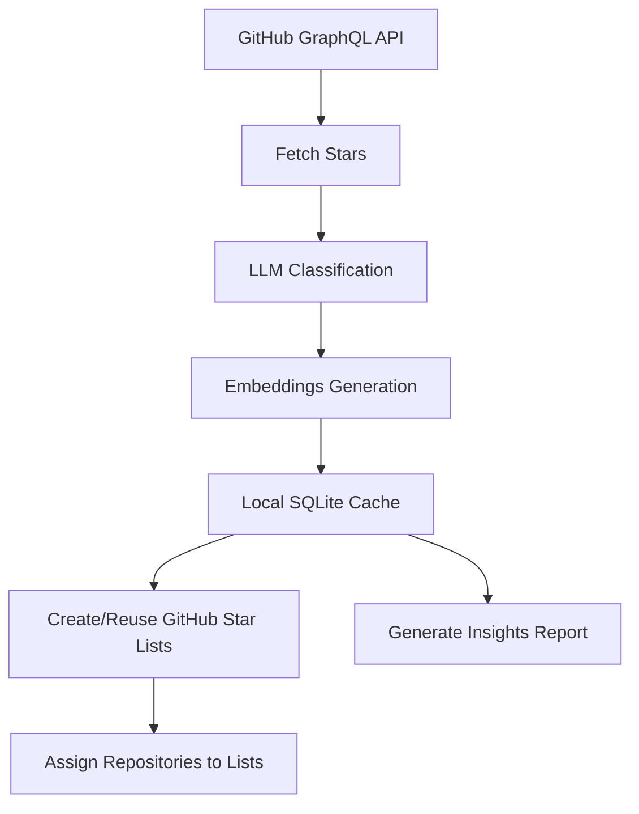

# gh-stars-organizer

`gh-stars-organizer` is a production-grade CLI that helps developers clean up and navigate huge GitHub star collections using LLM classification, embeddings, local caching, and GitHub Star Lists automation.

## Problem Statement

Most developers star hundreds of repositories, then struggle to rediscover useful ones. This tool solves that by:

- Fetching all starred repositories
- Classifying them into meaningful categories
- Creating/reusing GitHub Star Lists automatically
- Building semantic search with embeddings
- Generating actionable developer insights

## How It Works

1. Fetch stars via `gh api graphql`
2. Classify repositories with an OpenAI-compatible LLM
3. Generate embeddings for semantic similarity
4. Cache everything in local SQLite
5. Build/update FAISS index
6. Create and populate GitHub Star Lists
7. Produce `stars-insights.md` recommendations

## Architecture



## Features

- GitHub stars sync with pagination support
- LLM classification with custom categories
- Embedding-based semantic search
- Automatic GitHub Star List creation and assignment
- Insights report: top categories, technologies, cleanup suggestions
- Repo discovery engine:
  - archived candidates
  - inactive repositories
  - potential duplicate clusters
- Local SQLite cache for classifications and embeddings
- Rate limiting and retries for GitHub and LLM APIs

## Installation

### Prerequisites

- Python 3.11+
- GitHub CLI (`gh`) authenticated (`gh auth status`)
- `OPENAI_API_KEY` (or compatible API key)

### Install from source

```bash
git clone https://github.com/<your-org>/gh-stars-organizer.git
cd gh-stars-organizer
python -m venv .venv
source .venv/bin/activate
pip install -e ".[dev]"
```

## Configuration

Default config path: `~/.gh-stars-organizer/config.yaml`

Generate default config:

```bash
gh-stars-organizer config --init
```

Example values are in `examples/config.yaml`.

## CLI Usage

```bash
gh-stars-organizer sync
gh-stars-organizer preview
gh-stars-organizer organize
gh-stars-organizer insights
gh-stars-organizer search "vector database for RAG"
gh-stars-organizer tui
```

### Commands

- `gh-stars-organizer organize`
- `gh-stars-organizer preview`
- `gh-stars-organizer insights`
- `gh-stars-organizer search <query>`
- `gh-stars-organizer config`
- `gh-stars-organizer sync`
- `gh-stars-organizer tui`

### TUI Mode

Launch the interactive terminal UI:

```bash
gh-stars-organizer tui
```

It provides:

- One-click sync, preview, organize, and insights actions
- Semantic search panel
- Live status updates while operations run

## Example CLI Output

```text
Fetching starred repositories...
Fetched 742 repositories.
Classifying repositories...
langchain-ai/langchain -> genai-llm-agents
fastapi/fastapi -> backend-api-frameworks
vercel/next.js -> frontend-ui-frameworks
Creating list: genai-llm-agents
Done. Created 8 lists and processed 742 repository assignments.
```

## Insights Report

Running `gh-stars-organizer insights` creates `stars-insights.md` with:

- Most Starred Categories
- Top Technologies
- Archived/inactive/duplicate recommendations

## Project Structure

```text
gh-stars-organizer/
├── gh_stars_organizer/
│   ├── cli.py
│   ├── github_client.py
│   ├── classifier.py
│   ├── embeddings.py
│   ├── cache.py
│   ├── organizer.py
│   ├── insights.py
│   ├── config.py
│   └── models.py
├── tests/
├── examples/
├── README.md
├── pyproject.toml
└── LICENSE
```

## Development

Run tests:

```bash
pytest -q
```

## GitHub Actions Workflows

- `CI` (`.github/workflows/ci.yml`): runs tests on Python 3.11/3.12 and validates package build on every push/PR.
- `Publish` (`.github/workflows/publish.yml`): builds and publishes to PyPI on GitHub Release publish (or manual dispatch).

### PyPI Publishing Setup

Use PyPI Trusted Publishing:

1. In PyPI, create a trusted publisher for this GitHub repository and workflow `publish.yml`.
2. In GitHub, keep the `pypi` environment (or create it) and allow this workflow to run.
3. Create a GitHub Release to trigger publish.

## Contribution Guide

See `CONTRIBUTING.md`.

## Publish to PyPI

```bash
python -m build
twine upload dist/*
```

## Future Extensions

Designed to support:

- automatic repository tagging
- GitHub Copilot integration
- developer skill graph
- AI recommendation workflows
- VSCode extension integration

## License

MIT
